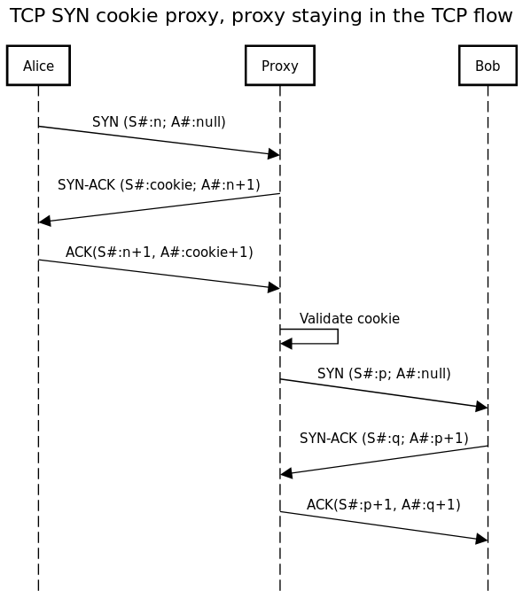

# Syncookie Proxy

## Strategy 4: After establishing the connection, forward the ACK to Bob reconstruct the session



1. Alice send SYN
2. Proxy send SYN-ACK with a cookie representing the connection in the Sequence Number
3. Alice send ACK
4. If the cookie is still in the Acknowledgment Number then the proxy validate the connection and will start establishing a new connection with Bob
5. The proxy send SYN to Bob with the same Sequence Number as Alice
4. Bob send SYN-ACK with his own Sequence Number
5. The proxy memorize the diff between the two Sequences Numbers
6. The proxy send a ACK and let consider the connection as established
7. everytime a frame pass throught the proxy, it'll patch the Sequence / Acknowledgment Number to match with each connection

-------------

* Works with all clients
* Works with all methods of calculating the cookie

## Introduction

In this repository we'll see if p4 seems suitable to implement a Syncookie Proxy.

The aim of the project is to implement multiple syncookie proxy strategy and to try to export our p4 code to multiple p4 backends (bmv2, eBPF, ...).

## Developement process

Currently we test our implementation with the bmv2 backend and mininet.

### Topology

<p align="center">

<p/>

### Obtening the required software

You should probably juste follow the instruction from this repository : https://github.com/nsg-ethz/p4-learning

### Running the application

```bash
sudo p4run
```

Also, since the `p4runtime` use some slow python code you should add some delay on your network if you don't want to see packet being dropped.

```bash
% sudo tc qdisc add dev s1-eth1 root netem delay 100ms
% sudo tc qdisc add dev s1-eth2 root netem delay 100ms
% sudo tc qdisc add dev s1-eth3 root netem delay 100ms
% sudo tc qdisc add dev s1-eth4 root netem delay 100ms
```

**Do not** apply this rule to the cpu interface.

To remove the rule use :
```
% sudo tc qdisc del dev s1-eth1 root
% sudo tc qdisc del dev s1-eth2 root
```

